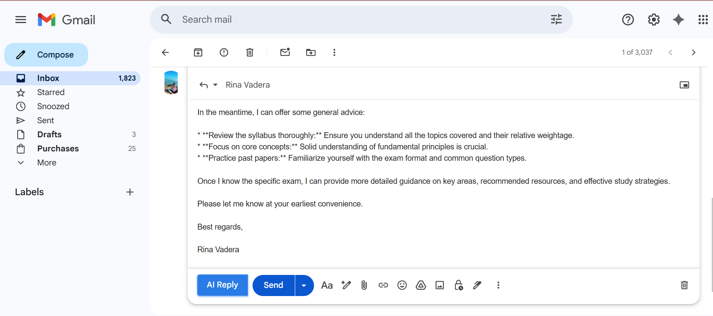
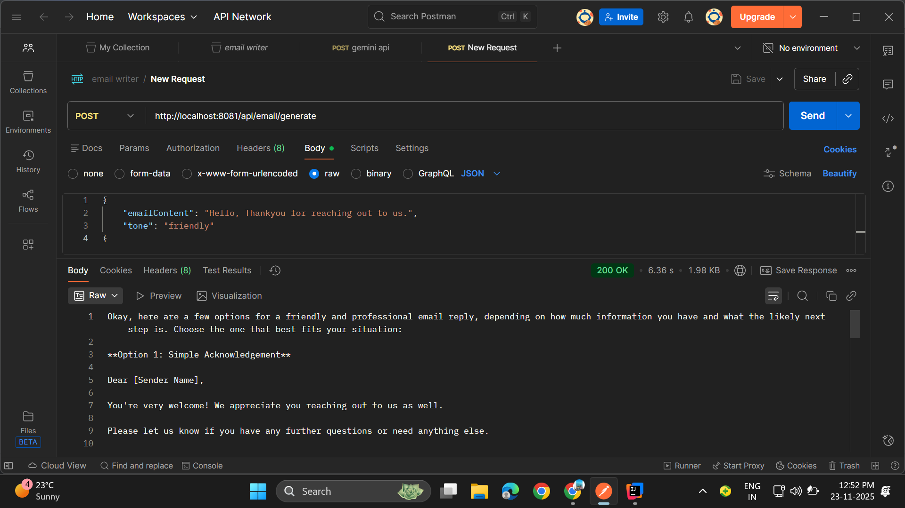

# 📧 AI-Powered Smart Email Assistant

A full-stack application that helps users generate professional, tone-specific email replies instantly using AI. The system integrates a Spring Boot backend, a React frontend, and a Chrome Extension that brings Google Gemini AI directly into your email interface.

## 🚀 Project Overview

This application solves the problem of drafting emails by allowing users to generate replies directly inside Gmail or Outlook. The Chrome Extension reads email content and sends it to a backend that uses the Google Gemini API to generate context-aware responses.

### Key Features
- Context-aware replies via Chrome Extension
- Google Gemini AI-powered email generation
- Tone Options: Professional, Casual, Friendly
- Full-Stack Architecture: Spring Boot + React + Chrome Extension
- One-click email drafting inside your inbox

## 🏗️ Tech Stack

| Component | Technology |
|----------|------------|
| Backend | Java, Spring Boot 3, Spring Web, WebFlux, Lombok |
| AI Engine | Google Gemini API |
| Frontend | React.js, JavaScript, Axios, Material UI (MUI) |
| Browser Extension | Chrome Extension API (Manifest V3), MutationObserver |

## 📂 Folder Structure
<details>
  <summary>📂 Repository Structure</summary>
  
```plaintext
  ai-smart-email-assistant/
│
├── email-writer-sb/                 # Backend (Spring Boot)
│   ├── src/
│   │   └── main/
│   │       ├── java/
│   │       │   ├── controller/
│   │       │   ├── service/
│   │       │   ├── config/
│   │       │   └── EmailWriterSbApplication.java
│   │       └── resources/
│   │           ├── application.yml
│   │           └── static/
│   ├── pom.xml
│
├── email-writer-react/               # Frontend (React)
│   ├── src/
│   │   ├── components/
│   │   ├── services/
│   │   ├── App.js
│   │   └── main.jsx
│   ├── public/
│   ├── package.json
│
├── email-writer-ext/                 # Chrome Extension (Manifest V3)
│   ├── manifest.json
│   ├── content.js
│   ├── background.js
│   └── assets/
│       ├── icon16.png
│       ├── icon48.png
│       └── icon128.png
│
├── assets/                           # Images for README
│   ├── extension-demo.png
│   └── workflow.png
│
├── reports/
│   └── project_overview.pdf
│
├── README.md
├── .gitignore

```
</details>

## 🛠️ Installation & Setup

### 1️⃣ Backend Setup (Spring Boot)

Run the backend:
cd email-writer-sb  
mvn spring-boot:run  

Backend runs at:
http://localhost:8080

### 2️⃣ Frontend Setup (React)

cd email-writer-react  
npm install  
npm start  

Frontend runs at:
http://localhost:3000

### 3️⃣ Chrome Extension Setup

1. Open Chrome → go to chrome://extensions/  
2. Enable Developer Mode  
3. Click "Load unpacked"  
4. Select the email-writer-ext folder  

The extension is now active.

## 🔌 How It Works

1. Chrome Extension detects when an email reply box opens  
2. It injects an "AI Reply" button  
3. User clicks the button → extension scrapes email content  
4. Content is sent to Spring Boot backend  
5. Backend sends a prompt to Google Gemini API  
6. Gemini generates a context-aware reply  
7. Reply is inserted back into the email textbox

---

## 📸 Screenshots

| Extension in Action | AI Generation UI |
| :---: | :---: |
|  |  |

| Generated Result | Backend API |
| :---: | :---: |
|  |  |

---

## 🚧 Future Enhancements

- OAuth authentication  
- Save drafts to database  
- Multi-language support  
- Pre-built email templates  

## 🤝 Contributing

Contributions, issues, and feature requests are welcome.
